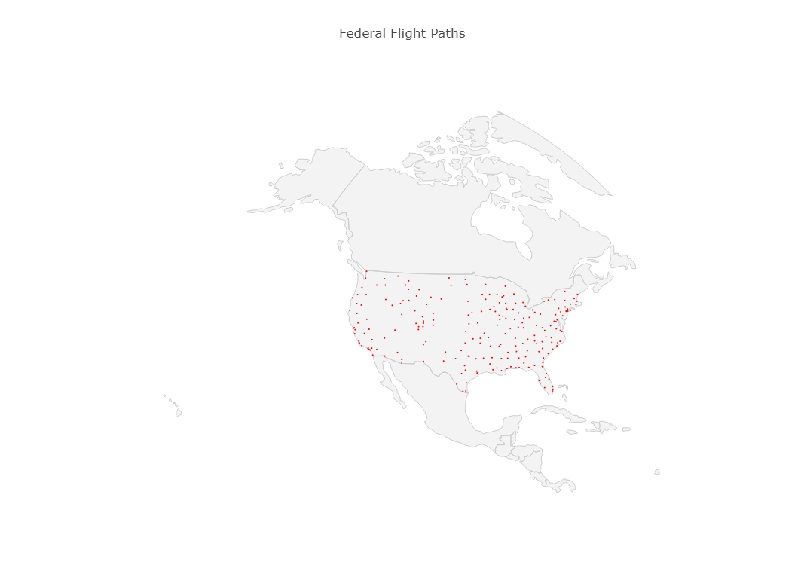
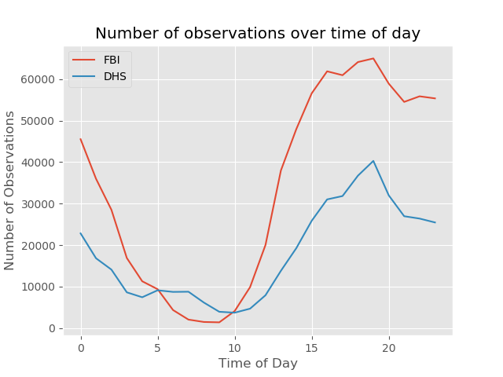
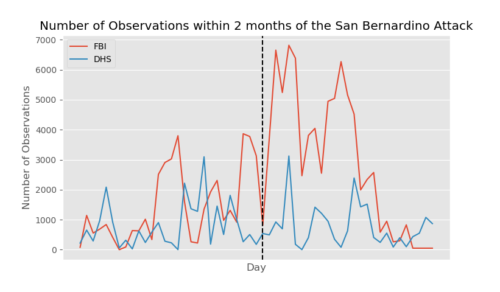

# Aerial Surveillance
## Analyzing the Behaviours of Aircraft Operated by The Department of Homeland Security and the Federal Bureau of Investigations

### Problem
In 2019, privacy, both in real life and in the digital world, is fast becoming a privilege, not a right. Facebook alone has set aside 5 billion dollars just for FTC fines over privacy concerns. Google made 32.6 billion from ad sales, mostly coming from targeted ads created by the information harvested from your online activity.  
Most importantly, the US Federal Government is actively limiting the scope of privacy rights for both its citizens and unlawful residents. This is a concern to everyone living under its jurisdiction, not just our lawmakers and activists. We have a responsibility to investigate the powers that the US Government is excercising, and communicate clearly with our representatives what is and is not ok. 
### Data
The data I use in this project comes from a [Buzzfeed News aarticle](https://github.com/BuzzFeedNews/2016-04-federal-surveillance-planes) in 2015. They cross-referenced flight data from https://www.flightradar24.com/ and the Federal Aviation Administration's [aircraft registration database](https://www.faa.gov/licenses_certificates/aircraft_certification/aircraft_registry/releasable_aircraft_download/) to compose a four month long dataset on all the flight data from planes owned or associated with the Department of Homeland Security (DHS) and the Federal Bureau of Investigation (FBI).  
While it was a relatively clean dataset (23 columns and 1.2 million rows) a lot of the information was extraneous or derived from other columns - I was able to cut it down to these 13: 
adshex,flight_id,latitude,longitude,altitude,speed,track,timestamp,name,n_number,mfr,model,agency 
The biggest struggle I had with datatypes was with the timestamp type; in the end I split it up into a 'month', 'day', and 'time' column for easier access. 
### Methodology
#### Heatmap

By far the longest amount of time I spent on this project was in my attempt to make a heatmap, and eventually have it animated across the time given by the dataset. Initially, I thought the dataset contained 40,000 data points, and set my poor Microsoft Surface to plot them all. After an hour with no results, I tried again at home with a slightly beefier computer. After an hour and a half of, all I had to show for it was a nice memory error. Turns out the data set was 1.2 million, not 40,000, and 8 gigs of ram did not cut it. My second option was to plot by day, so that we could see some change over time. Unfortunately, as you can see from the graph, the resulting plots are not very interesting. Because these are all surveillance planes, they take off and land at the same airport. So instead of nice flightpaths, we just get a bunch of dots. That don't change over time. So we had to scrap this idea.
#### Activity during the week

This is a much more informative graph. We can see here that the time of day with the least observations is actually between 5am and 10am, with a peak around 7pm. I can make some educated guesses about how the illicit activities that the departments are tracking are in the evening, but I welcome any other ideas as to why the graph takes the shape that we see. As an aside, and we'll see this in the next graph too, FBI activity tends to be more dense than DHS within the continental United States. As a general rule of thumb, we can broadly catagorize the three major defense departments: CIA handles international affairs, FBI handles threats to the United States from within the country, and the DHS focuses on that transition, with an emphasis on boarder control and similar functions. 
#### 2015 San Bernardino Attack

While there were plenty of domestic incidents to attempt to cross reference with the data, I narrowed my search to California, having the highest density of observations in the data set. On December 2, 2015, 14 people were killed and 22 others were seriously injured in a terrorist attack consisting of a mass shooting and an attempted bombing at the Inland Regional Center in San Bernardino, California. When we graph the FBI and DHS activity in the month leading up to the attack and the month after, we can clearly see the difference in responsibilities: the DHS activity does not change at all, while the FBI nearly doubles the flights afterwards. This is also a good indication that neither department predicted it would happen, as there is no change leading up to it.
#### Future Works
There are a number of ways that this project can evolve. With flightradar24.com's API, we can keep live tabs on known federally-associated planes, potentially keeping us informed of events before they even hit the media. With proper regression techniques, it might be possible to predict how each department will react to certain scenarios, or even guess as to certain areas of interest even if no auspicious event has occurred. 
In conclusion, being able to keep track of some of the federal governments most usefull surveillance tools is a huge boon to the common citizen, and we should absolutely use this information and sources like it to stay informed about the modern world.
